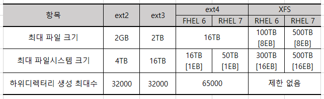

# Linux

## 1.  리눅스의 개요

### 1. 운영체제의 기초

### 2. 리눅스 기초

## 2.  리눅스 시스템의 이해

### 1. 리눅스와 하드웨어

> - 개인용 컴퓨터에 사용할 수 있는 유닉스 호환 운영체제를 만들기 위함 -> 저사양(인텔 386, 486)에서 잘 작동
>
> - 운영체제가 점차 GUI환경으로 변함에 따라 고사양이 요구됨
>
>   | 레드햇, 수세                                | 데비안 계열 |
>   | ------------------------------------------- | ----------- |
>   | 기업용, 서버용                              | 개인용      |
>   | CPU, 메모리, 하드 등 하드웨어 요구사항이 큼 |             |
>
>   -> 요구되는 목적에 따라 적절하게 사용해야 함
>
> - 최근에는 가상화 기술 때문에 CPU의 물리적 개수뿐만 아니라 core개수도 중요해졌다.
>
> - 과거에는 메모리 규격에 따라 사용가능여부가 달랐으나 요즘에는 대부분 다 지원한다
>
>   * `(Swap) 스왑 : 하드디스크의 일부 공간을 램처럼 사용하는 기술`
>   
> - 하드디스크 : 
>
>   - IDE -> E-IDE -> SCSI - S-ATA 순서대로 발전
>
>   - IDE 에서는 /dev /hdx , 이후에는 /dev /sdx 사용
>
> - 기타 장치는 별로 어렵지 않고 배경지식선에서 해결된다.
>
> - RAID(Redundant Array of Independent : 중복 독립 배열 )
>
>   > - 여러개의 HDD가 있을 때 동일한 데이터를 여러개의 HDD에 나눠 저장하는 방법이다.
>   >
>   > - 입출력작업의 균형으로 성능향상을 기대할 수 있다.
>   >
>   > - 논리적으로 하나의 디스크로 인식하여 처리된다.
>   >
>   > - 초기에는 저용량 데이터를 하나의 디스크로 확장하는 것이 주류였으나 현재는 백업, 안정성과 속도향상 등에 목적이 있다.
>   >
>   > - HW, SW적 구현이 각각 가능하다.
>   >
>   >   | HW                                                      | SW          |
>   >   | ------------------------------------------------------- | ----------- |
>   >   | 성능적 측면                                             | 비용적 측면 |
>   >   | 핫 스왑 베이(Hot Swap Bay) : HDD가 켜진상태로 교체 가능 |             |
>   >
>   > - 주요기술
>   >
>   >   - 스트라이핑 : 연속된 데이터를 여러개의 디스크에 라운드로빈 방식으로 저장한다.  드라이브의 개수만큼 향상된 속도를 사용할 수 있다.
>   >   - 미러링 : 데이터의 손실을 막기 위해 같은 데이터를 중복해서 저장하는 방식이다. 이 기법은 HW뿐만 아니라 SW적으로도 구현이 가능하다.
>   >
>   > - 종류
>   >
>   >   - RAID-0 : 스트라이핑 기술만 사용한다. 오류에 취약하다. 디스크를 많이쓰는 만큼 속도가 향상.
>   >
>   >   - RAID-1 : 미러링 기술만 사용한다. 디스크낭비가 50%에 이른다. 성능은 단일디스크와 같다.
>   >
>   >   - RAID-2 : 스트라이핑 기술을 사용하되, ECC(Error Check & Correction) 정보를 사용한다.
>   >
>   >   - RAID-3 : 스트라이핑 기술을 사용해 디스크를 구성하고, 패리티정보를 저장하는 디스크를 하나 더 사용한다.
>   >
>   >   - RAID-4 : 블록형태 스트라이핑 기술을 사용한다. 단일 디스크를 읽을 수 있다. 패리티연산 때문에 병목현상이 발생할 수 있다.
>   >
>   >   - RAID-5 : 패리티정보를 분산하여 디스크고장이 있어도 사용이 가능하다. 최소 3개의 디스크로 구성해야 하고, 전체의 1/n만큼 패리티공간이 생긴다. 디스크의 개수를 늘릴수록 효율이 늘어난다. 1개의 디스크오류에만 대처가 가능하다.
>   >
>   >   - RAID-6 : RAID-5와 유사하나, 2차 패리티 구성을 한다. 신뢰도는 높으나 속도가 떨어진다. 알고리즘이 복잡하다. 2/n만큼 패리티공간이 생긴다. 2개의 디스크 오류에도 대처가 가능하다.
>   >
>   >   - RAID-7 : 실시간 운영체제를 사용한다. 버스를 이용한다. 
>   >
>   >   - RAID 0+1 : 스트라이핑과 미러링을 동시에 사용한다. 효율은 50%, 최소 4개의 디스크가 필요하다. 스트라이핑후에 미러링한다.
>   >
>   >   - RAID-10 : RAID 0+1과 반대로 미러링 후에 스트라이핑한다.
>   >
>   >   - RAID-53 : RAID-3방식에 별도로 스트라이프 Array를 구성한다. -3보다 높은 성능을 보이지만 비용이 많이든다.
>   >
>   > - LVM(Logical Volume Manager)
>   >
>   >   - 리눅스를 설치할 때나 하드디스크를 추가할 때 파티션을 분할하고 공간을 할당한다.  이때 설정한 공간이 고정되어 변경이나 증설이 어렵다.  => 이것을 해결하기 위해 LVM을 사용한다.
>   >   - LVM은 찰흙과 같다. 여러개를 뭉칠 수도 있고, 하나를 쪼갤 수도 있다.
>   >   - 데이터 이전없이 손쉽게 가능하다.
>   >
>   > - LVM관련 용어
>   >   - 물리적 볼륨 (PV : Physical Volume) : 물리적으로 분할한 파티션
>   >   - 볼륨그룹(VG : Volume Group) : PV가 모여서 생성하는 덩어리를 VG라고 한다. 또는 PE가 모여서 생성되는 큰 덩어리이다.
>   >   - 논리적 볼륨(LV : Logical Volume) : VG에서 사용자가 필요한 만큼 할당하여 만들어지는 공간이다.
>   >   - 물리적 확장(PE : Physical Extent) : PV에서 사용하는 일종의 블록이다. 보통 1PE가 4MB정도이다.

### 2. 리눅스의 구조

> - 부트매니저
>
>   > - 부팅을 도와주는 역할을 하는 프로그램 -> 부트로더(BootLoader)라고 부른다.
>   >
>   > - 컴퓨터에 리눅스, 윈도우 등 여러 운영체제가 설치되어 있을 경우에 선택하여 부팅하게 해준다.
>   >
>   > - HDD의 맨 앞쪽영역 MBR(Master Boot Record)에 설치된다. 
>   >
>   >   => MBR은 디스크의 첫 번째 섹터(0번 섹터)에 해당하고 512byte이다. 부트매니저와 파티션정보를 기록한다.
>   >
>   > - 리눅스에서는 LILO(Linux Loader)와 GRUB(Grand Unified BootLoader)를 사용한다.
>   >
>   >   - LILO는 파일시스템에 구애받지 않고 FDD, HDD를 이용한 부팅을 지원했었다.
>   >   - HDD에 접근할 때 바이오스정보만 참고한다. 8GB 영역 밖은 인식하지 못한다.
>   >   - 환경설정파일인 /etc/lilo.conf를 수정하고 lilo라는 명령을 수행하는 불편함 때문에 잘 안쓴다.
>   >
>   > - GRUB
>   >
>   >   - 현재 배포판들은 대부분 GRUB을 사용한다.
>   >   - GNU 프로젝트에서 만든 부트로더이다.
>   >   - LILO에 비해서 다양한 파일 시스템을 지원하고, 동적인 부팅이 가능하다.
>   >   - 인터페이스방식을 사용하지만 Bash도 사용가능하다.
>   >   - 그래픽환경을 제공한다.
>   >   - /boot/grub/grub.conf에서 설정하고 재부팅하면 반영된다. => 레드햇계열
>   >
>   > - 메뉴화면에서 a, e, c를 누르면 부팅모드를 설정할 수 있다.
>   >
>   >   > - a :  kernel과 관련된 부분의 매개변수를 추가할 수 있게 해준다. 싱글모드로 진입한다면 1 또는 single을 입력하면 된다.
>   >   >
>   >   > - e : 부팅 목록의 모든 항목들을 직접 편집할 수 있다. grub.conf의 내용이 바뀌는 것은 아니고 1회에 한해 일시적으로 적용된다. [ESC]키를 누르면 초기화된다.
>   >   >
>   >   >   > <명령어>
>   >   >   >
>   >   >   > e : 커서가 위치한 줄 편집
>   >   >   >
>   >   >   > d : 커서가 위치한 줄 삭제
>   >   >   >
>   >   >   > o : 커서 아래에 명령줄 추가
>   >   >   >
>   >   >   > O : 커서 위에 명령줄 추가
>   >   >   >
>   >   >   > b : 부팅을 시작
>   >   >
>   >   > - c : 상호 대화식으로 명령을 직접 입력할 수 있다. Bash와 유사하다. [TAB]을 이용해서 명령행 자동완성을 사용할 수 있다. 마지막 라인에서 boot라고 입력하면 부팅된다.
>   >   >
>   >   > ```bash
>   >   > #boot=/dev/sda						# 부팅되는 하드디스크를 지정
>   >   > default=0 							# 0번째 운영체제를 선택 여기서는 CentOS 
>   >   > timeout=10							# 10초간 선택이 없으면 default로 부팅
>   >   > splashimage=(hd0,3)/boot/grub/splash.xpm.gz # GRUB 화면의 배경이미지를 지정
>   >   > 											# gz파일은 이미지파일이다
>   >   > title CentOS (2.6.32-358.el6.i686)			# (hd0,0) -> /dev/sda1
>   >   > 	root (hd0,3)							# (hd0,3) -> /dev/sda4
>   >   > 	kernel /boot/vmlinuz-2.6.32-358.el6.i686 ro root=UUID=fa853197-a720...
>   >   > 	initrd /boot/initramfs-2.6.32-358.el6.i686.img
>   >   > title DOS
>   >   > 	rootnoverify (hd0,0)
>   >   > 	chainloader +1
>   >   > ```
>   >
>   
> - 디렉터리(Directory)
>
>   > - / : 최상위 디렉토리 root라고 한다.
>   > - /bin : binary의 약자로 실행파일들이 들어있다. 명령어들이 이 디렉터리에 들어있다.
>   > - /boot : 부팅 이미지 파일이나 커널 시스템 부팅시 필요한 파일이 들어있다. grub관련 파일도 여기 있다.
>   > - /dev : HDD, CD-ROM과 같은 실제로 존재하는 물리장치들을 파일화 하여 관리한다.
>   > - /etc : 시스템 환경 설정 파일들이 들어있다. 네트워크, 사용자정보 등 중요설정 파일들이 있다.
>   > - /home : 개인 사용자들이 파일이나 디렉터리를 만들어서 사용할 수 있는 홈 디렉터리 예를들어 SJ라는 계정을 만들면 /home/SJ라는 디렉터리가 생긴다. 
>   > - /lib : 각종 라이브러리가 저장되어 있는 디렉토리이다. 커널 모듈도 여기에 들어있다.
>   > - /mnt : CD-ROM, FDD, HDD, 등을 마운트할 때 포인터가 되는 디렉터리다. 최근에는 /media, /net 등을 추가적으로 사용한다.
>   > - /misc : 자동 마운트 프로그램에 의해 사용된다.
>   > - /opt : 응용프로그램의 설치를 위해 사용된다.
>   > - /proc : 가상 파일 시스템, 프로세스의 상태정보, 하드웨어 정보 등을 담고 있다.
>   > - /sbin : system binary로 시스템관련 명령어들이 들어있고 root가 주로 사용한다. 시스템종료, 네트워크 인터페이스, 시스템점검, 복구를 처리한다.
>   > - /tmp : 임시 저장 디렉터리, 모든 사용자가 접근 가능하다.
>   > - /usr : 시스템 운영에 필요한 명령, 응용 프로그램들이 위치하는 디렉터리, 컴파일러, mysql,  X-window 등이 들어있다.
>   > - /var : 시스템운영로그, 스풀링과 같은 가변적인 데이터를 보관한다. 메일 서버로 운영한다면 도착한 메일이 이곳에 저장된다.
>
>  - 부팅(Booting) & 셧다운(Shutdown)
>
>    > - 부팅은 컴퓨터의 전원이 켜진 후 운영체제가 가동되어 사용자가 컴퓨터를 쓸 수 있도록 하는 과정
>    >
>    > - 하드웨어를 인식하는 단계, 운영체제와 응용 프로그램들을 메모리에 상주시키는 단계
>    >
>    >   > BIOS가 하드웨어를 점검 => CMOS에 저장된 부팅디스크 확인 => MBR의 부트로더 실행 
>    >   >
>    >   > => 환경설정파일을 참고하여  부팅 시작
>    >
>    > - 리눅스에서는 MBR에 설치된 GRUB을 실행시키고 X-window가 구동되기까지의 과정
>    >
>    >  - HW  인식단계
>    >
>    >    > HW의 드라이버를 모듈화하여 부팅시 /etc/modprobe.conf에 등록된 모듈들을 읽어들여 커널에 적재한다.
>    >
>    > - SW 구동단계
>    >
>    >   > /root를 읽기 전용 형태로 마운트하고 검사 후 이상이 없으면 쓰기 가능 형태로 다시 마운트한다. 
>    >   >
>    >   > 그리고 커널은 init 프로세스를 발생시키고 SW구동은 init 프로세스에 위임된다.
>    >   >
>    >   > /etc/inittab : 실행레벨정의
>    >   >
>    >   > /etc/init/rcS.conf : 시스템초기화 RAID, LVM 장치 활성화
>    >   >
>    >   > /etc/init/rc.conf : 부팅시 레벨별로 진행되는 내용이 설정된 파일
>    >   >
>    >   > /etc/rc.d/rc.local : 실행 레벨 2,3,5 에서 가장 마지막에 실행되는 파일
>    >
>    > - 실행레벨(Runlevel)
>    >
>    >   > 8단계로 구성 마지막은 안전모드
>    >   >
>    >   > 0 : 시스템의 중지 => 기본값x
>    >   >
>    >   > 1 : 단일 사용자 모드 => 관리자모드
>    >   >
>    >   > 2 : 네트워크를 사용하지 않는 다중 사용자모드
>    >   >
>    >   > 3 : 네트워크를 지원하는 다중 사용자 모드
>    >   >
>    >   > 4 : 사용되지 않음, 사용자 정의 모드
>    >   >
>    >   > 5 : x윈도를 사용하는 다중 사용자 모드 => 최근 배포판의 default
>    >   >
>    >   > 6 : 시스템 재부팅 => 기본값 x
>    >
>    > - 로그인
>    >
>    >   >사용자변경은 [Ctrl + Alt + F1~F6]이다. =>실행레벨3
>    >   >
>    >   >실행레벨 5에선는 X-window기반 로그인창이 나타난다.
>    >   >
>    >   >아이디와 패스워드를 입력해서 접근권한과 사용권한을 획득한다.
>    >   >
>    >   >/etc/issue : 로그인 전에 출력되는 메시지를 기록하는 파일
>    >   >
>    >   >/etc/issue.net : 위와 같은 역할이나 텔넷을 통해 접속할 때 출력되는 메시지이다.
>    >   >
>    >   >/etc/motd : 성공적으로 로그인 되었을 때 나타나는 메시지이다.
>    >
>    > - 로그아웃
>    >
>    >   > 로그인만 되어있고 작업을 하지 않으면 자원도 낭비되고 보안상의 위험이 있다.
>    >   >
>    >   > 콘솔모드에서는 logout, exit명령어를 입력하거나 [Ctrl+D]로 로그아웃 할 수 있다.
>    >   >
>    >   > X-window모드에서는 메뉴를 통해 로그아웃 할 수 있다.
>    >   >
>    >   > /etc/profile에 TMOUT=초 로 자동로그아웃을 설정할 수 있다.
>    >
>    > - PW를 잃어버렸을 경우 단일 모드로 (LEVEL1) 로그인해서 초기화 한다.
>    >
>    > - 셧다운
>    >
>    >   >shutdown, halt, reboot, poweroff, init 등의 명령어를 이용해 종료한다.
>    >   >
>    >   >- shutdown [option] 시간 [경고메시지]
>    >   >
>    >   >```bash
>    >   ># shutdown -r now		# -r 재부팅 명령
>    >   ># shutdown -h now		# -h 종료 명령 (halt)
>    >   ># shutdown -h +10		# 10분 뒤 종료 / 최근에는 +기호 없이도 된다
>    >   ># shutdown -c			# 종료명령 취소
>    >   ># shutdown -h 23:59		# 23:59에 종료하도록 예약
>    >   ># shutdown -k 10 "mss"	# 종료를 실행하지는 않고 경고 메시지만 전송
>    >   >```
>    >   >- reboot [option]
>    >   >
>    >   > ```bash
>    >   >  # reboot			# 즉시 리부팅한다.
>    >   >  # reboot -w			# 리부팅은 안하고 기록만 저장한다.
>    >   > ```
>    >   >
>    >   >- halt [option]
>    >   >
>    >   > ```bash
>    >   >  # halt			# 즉시 종료한다.
>    >   >  # halt -p		# 즉시 종료하고 전원까지 끈다.
>    >   > ```
>    >   >
>    >   >- poweroff
>    >   >
>    >   > ```bash
>    >   >  # poweroff		# 시스템을 종료하고 전원을 끈다.
>    >   > ```
>    >   >
>    >   >- init, telinit 실행레벨
>    >   >
>    >   > ```bash
>    >   >  # init 0		# 시스템을 즉시 종료한다.
>    >   >  # init 6		# 시스템을 즉시 재부팅한다.
>    >   >  # init 1		# 시스템을 즉시 단일 사용자 모드로 전환한다.
>    >   > ```
>    >   
>
> - 파일 시스템의 이해
>
>   > - 파일 시스템이란 운영체제가 파티션이나 디스크에 데이터를 읽고, 쓰고, 찾기 위해 구성하는 체계이다.
>   >
>   > - 운영체제를 설치할 때 포맷이라는 행위한다.
>   >
>   >   => 파일을 저장하기 위해 디스크를 분할하고 주소를 설정하는 작업
>   >
>   > - 파일이라는 단위로 저장하고 이름을 부여해 디렉터리에 저장한다. 
>   >
>   > - 확장자를 쓰도록 지정하고 확장자의 길이르 제한하기도 한다.
>   >
>   > - 파티션의 개수, 크기, 파일 크기 등에도 관계가 있다 => 시스템 성능과 밀접한 관계가 있다.
>   >
>   > ``` bash
>   > < 파일 시스템의 기능 >
>   > 1. 파일을 생성, 수정, 삭제할 수 있도록 제공
>   > 2. 사용자가 파일을 사용하기 적합한 형태의 구조로 구성하고, 추가정보 제공
>   > 3. 다른 사용자와 파일을 공동으로 사용할 수 있는 제어방법 제공
>   > 4. 파일 공유를 위해 판독, 기록, 수행 등 다양한 접근 제어 방법 제공
>   > 5. 정보 손실이나 파괴를 방지하기 위하여 백업, 복구 기능준비
>   > 6. 사용자와 장치간의 독립성을 유지하기 위해 물리적인 장치 이름대신 적절한 이름 제공
>   > 7. 정보를 안전하게 보호하고 비밀을 보장할 수 있도록 암호화, 복호화 기능 제공
>   > 8. 사용자가 파일이나 디레터리에 접근하기 쉬운 인터페이스, 명령어 제공
>   > ```
>   >
>   > - 리눅스는 유닉스의 영향을 받아 개방적인 특징을 가지고 있다. => 다양한 파일시스템 지원
>   > - ext를 시작으로 현재는 대부분 ext4를 사용한다. 
>   >   - Journaling File System이 ext3에서 처음 제공되었다.
>   >   - 저널이라고 부르는 로그에 변경사항을 저장해 데이터복구확률을 높여주는 것이다.
>   >
>   > <주요 파일 시스템>
>   >
>   > 
>   >
>   > -  리눅스 파일 시스템의 구조
>   >
>   >   디스크 드라이브를 이용할 때는 (파티션을 분할 -> 포맷)  하여 파일시스템을 생성한다.
>   >
>   >   -  ext4(ext2기반) - 파티션> 그룹블럭> 슈퍼블럭(파일시스템정보)+데이터블럭(간접블록 + 홀)
>   >   
>   > -  **<u>저널링기술</u>**
>   >
>   >    데이터를 디스크에 쓰기 전에 로그에 데이터를 남겨 시스템의 비정상적인 종료에도 안정적인 복구를 제공하는 기술 ext3, ext4, XFS, JFS, ReiserFS에서 사용한다.
>   >
>   > -  **<u>아이노드(I-node)</u>**
>   >
>   >    유닉스계열 파일시스템에서 사용하는 자료구조
>   >
>   >    아이노드넘버, 접근모드(권한), 파일형식(파일,디렉터리), 소유자정보(소유자,그룹), 파일크기, 타임스탬프를 저장한다.
>   >
>   >    파일시스템을 생성할 때 전체공간의 1%정도를 할당하므로 최대 파일개수가 정해져있다.

### 3. x윈도

>< X윈도의 개념과 특징 >
>
>> 플랫폼과 독립적으로 작동하는 그래픽 시스템을 개발하기 위해 DEC, IBM, MIT가 시작한 Athena프로젝트의 일환으로 1984년 최초 발표 
>>
>> 네트워크 프로토콜에 기반을 둔 사용자 인터페이스 환경이다.
>>
>> 디스플레이장치에 의존적이지 않고, 이 기종을 함께 사용할 수 있다. 스크롤바, 아이콘, 색상 등의 그래픽 환경에 필요한 자원들이 특정한 형태로 정의되어 있지 않아 사용자가 원하는 모양의 인터페이스를 만들 수 있다.
>>
>> - XFree86
>>
>>    IBM 호환 시스템을 ㅅ용하는 유닉스 계열 운영체제를 위한 X 윈도 프로젝트, 현재는 개발중단
>>
>> - X.org
>>
>>    자유 소프트웨어, 현재 대부분 사용 중이다. 
>>
>> - 구조
>>
>>   X 윈도는 클라이언트-서버 구조로 되어있고 X protocol을 사용한다.
>>
>>   X 서버는 그래픽 하게 보여주는 시스템이다.
>>
>>   X 클라이언트는 X서버 위에서 동작하는 응용프로그램이다.
>>
>> - Xlib
>>
>>   C언어로 구현된 클라이언트 라이브러리다. 개발자들은 프로토콜에 대한 자세한 정보를 몰라도 Xlib를 통해 다양한 프로그램을 구현할 수 있다.
>>
>>   Xt(Intrinsics), Xaw(Athena widget set), Motif, FLTK, GTK+, Qt, Tk, SDL등이 있다.
>>
>>   최근에는 Xlib대신 XCB를 사용한다. -> 확장성이 뛰어나고 크기가 작고 단순하다. 프로토콜에 직접 접근할 수 있다.
>
>< X윈도 설정과 실행 >
>
>> - X 윈도 설정
>>
>>   가장 중요한 것은 그래픽 카드 설정이다. 가장 정확한 드라이버를 설치하는 것이 좋지만, 아니더라도 호환가능하다.
>>
>> - X 윈도 실행
>>
>>   부팅시에 Runlevel 5로 실행한다.
>>
>>   ```bash
>>   id:5:initdefault: #그래픽환경 기반 설치 유틸리티인 anaconda를 사용하면 세팅되는 기본값
>>   ```
>>
>>   Runlevel 3(텍스트모드)로 부팅해서 `startx` 라는 명령어를 사용해도 된다.
>>
>> - 디스플레이 매니저
>>
>>   XDM, GDM, KDM  //순서대로 세련된형태
>>
>> - startx [option]
>>
>>   시스템 환경을 초기화시키고 여러 프로그램을 호출하고, 최종적으로 xinit을 호출한다.
>>
>>   ```bash
>>   $ startx -- -depth 8	# 8비트(256color) 모드로 실행x
>>   $ startx -- -depth 16	# 16비트 모드로 실행
>>   $ startx -- :1			# 두 번째 윈도 터미널([Ctrl+Alt+F8])에 X 윈도를 실행시킨다.
>>   ```
>
>< 데스크톱 환경 >
>
>> 노트북 데스크톱을 말하는게 아니다….
>>
>> 바탕화면에서 사용하는 desktop과 연결된다.
>>
>> 윈도매니저, 파일관리자, 아이콘, 창, 도구모음, 폴더, 배경화면, 위젯등을 제공한다.
>>
>> GNOME, KDE, Xfce, LXDE등이 있다
>>
>> - KDE
>>
>>   Qt 라이브러리를 기반으로 만들어졌다
>>
>>   리눅스 뿐만 아니라 FreeBSD, Solaris, MSwindow, OS X등도 지원한다.
>>
>>   초기에는 GPL 라이선스를 따르지 않았다, 현재는 공개되어있음
>>
>> - GNOME(GNU Network Object Model Environment)
>>
>>   GPL라이센스를 따르지 않는 KDE의 대안으로 만들어졌다.
>>
>>   GTK+를 기반으로 만들어졌다.
>>
>>   데스크탑, 라이브러리는 LGPL, 응용프로그램은 GPL을 따르도록 했다.
>>
>>   단순하고 사용하기 쉽고 그냥 동작하는 것이 목표
>>
>>   다양한 프로그래밍 언어를 허용한다.
>>
>>   nautilus -> metatcity -> Mutter라는 윈도매니저를 사용한다.
>
>< 윈도 매니저 >
>
>> X 윈도 환경에서 window의 배치와 표현을 담당하는 시스템 소프트웨어이다.
>>
>> 비디오 카드, 마우스, 키보드 등에 접근하지 않고, 디스플레이 서버를 통해서 접근한다.
>>
>> - 윈도 매니저의 종류
>>
>>   GNOME계열 metacity, Mutter / KDE계열 KWM, KWin
>
>< X 윈도 활용 >
>
>> - 원격지에서 X 클라이언트 이용 (1)
>>
>>   X 윈도는 X 서버와 X 클라이언트가 독립적으로 동작한다.
>>
>>   접근허가를 위해 xhost라는 명령어를 사용한다.
>>
>>   X 클라이언트에서 원격지인 X 서버에 프로그램을 전달하기 위해서 환경변수(DISPLAY)를 수정해야한다.
>>
>>   ```bash
>>   # xhost					# 현재 설정된 접근 목록을 출력한다.
>>   # xhost +				# 모든 클라이언트의 접속을 허용한다.
>>   # xhost -				# 모든 클라이언트의 접속을 차단한다.
>>   # xhost + 192.168.12.22	# 주소의 접속을 허가한다.
>>   # xhost - 192.168.12.22	# 주소를 접근허가 목록에서 제거한다.
>>   ```
>>
>>   DISPLAY
>>
>>   ```bash
>>   $ echo $DISPLAY
>>   :0.0			# 첫번째 x윈도.첫번째 디스플레이 를 뜻한다.
>>   # export DISPLAY="203.247.51.100:0.1"
>>   				# X 클라이언트 프로그램을 주소의 두번째 모니터로 전송한다.
>>   ```
>>
>> - 원격지에서 X 클라이언트 이용 (2)
>>
>>   xauth
>>
>>   접근허가 인증키 관련 파일 도구이다.
>>
>>   ```shell
>>   # xauth list $DISPLAY
>>   www/unix:0 MIT-MAGIC-COOKIE-1 ed41d53ee
>>   			# MIT-MAGIC-COOKIE-1의 키 값을 출력한다. 설치까지한다.
>>   # xauth add $DISPLAY . ed41d53ee
>>   			# 서버에서 보내온 키 값을 설치한다.
>>   ```
>> ```
>> 
>> ```
>
>< X 윈도 응용 프로그램 >
>
>> < GNU >
>>
>> - GIMP : 사진편집 = 포토샵
>> - Totem : 동영상재생
>> - eog : 이미지뷰어
>>
>> < KDE >
>>
>> - kdegraphics : 그래픽관련 패키지 (gwenview, kolourpaint, ksnapshot, okular)
>>
>> - KMid : 미디
>> - Imageagick : 비트맵이미지 생성, 편집
>>
>> < 기타 >
>>
>> - Rhythmbox : 음악관리
>> - evince : 문서뷰어 PDF, PS, EPS
>> - LibreOffice
>>   - Writer : word
>>   - Impress : PPT
>>   - Calc : excel
>>   - Draw : paint

### 4. Shell

> < Shell 이해 >
>
> 쉘은 커널과 사용자간의 다리역할을 하는 것이다.
>
> 사용자의 명령을 해석하고 프로그램을 실행한다.
>
> 현재는 bash가 표준이다.
>
> 본쉘(sh), bash, C쉘(csh), tcsh(csh강화), 콘쉘(ksh)
>
> < 쉘의 확인과 변경 >
>
> - 사용중인 쉘의 확인
>
>   echo $SHELL
>
>   chsh -l
>
>   cat/etc/shells
>
> - 쉘의 변경
>
>   chsh 입력 -> 사용자암호 -> 바꾸려는 쉘의 경로
>
> - 로그인 쉘 정보 확인
>
>   /etc/passwd의 7번째 필드에 기록된다.
>
> < 쉘 환경 설정 >
>
> - 쉘 변수
>
>   특정한 쉘에서만 적용되는 변수를 말한다. 
>
>   변수값을 출력할 때는 변수명 앞에 $를 붙이고 echo 명령으로 확인한다.
>
>   ```bash
>   $ echo $city
>   ```
>
> - 환경 변수
>
>   환경변수란 프롬프트 변경, PATH 변경 등 쉘의 환경을 정의하는 중요한 변수이다.
>
>   환경변수는 미리 예약된 변수명을 사용한다.
>
>   ```bash
>   HOME		# 홈 디렉터리
>   PATH		# 실행 파일을 찾는 디렉터리
>   LANG		# 쉘 사용시 기본으로 지원되는 언어
>   TERM		# 로그인한 터미널의 종류
>   PWD			# 현재 작업 디렉토리
>   SHELL		# 로그인 쉘
>   USER		# 사용자의 이름
>   DISPLAY		# X윈도에서 프로그램 실행시 출력되는 창
>   PS1			# 프롬프트 변수
>   PS2			# 2차 프롬프트 변수
>   HISTFILE	# 히스토리 파일의 절대 경로
>   HISTSIZE	# 히스토리 파일에 저장되는 명령어 개수
>   HISTFILESIZE# 히스토리 파일의 크기
>   HOSTNAME	# 시스템의 호스트명
>   MAIL		# 메일이 저장되는 경로
>   TMOUT		# 로그아웃 시키는 시간 (초)
>   UID			# 사용자의 UID
>   ```
>
>   환경 변수는 명령어와 결합하여 사용한다.
>
>   ```bash
>   $ mkdir $HOME/data
>   \d	# 요일 월 일 형태로 날짜를 표시
>   \h	# 호스트 이름
>   \s	# 사용중인 쉘의 이름
>   \t	# 24시 형태의 현재 시간을 표시
>   \T	# 12시 형태의 현재 시간을 표시
>   \@	# 12시 형태에 PM/AM 추가
>   \u	# 사용자의 이름 표시
>   \w	# 현재작업 디렉터리의 절대경로
>   \W	# 위 경로중 마지막 디렉터리만 표시
>   \!	# 현재 명령의 히스토리넘버
>   \\	# \를 표시
>   ```
>
> < 배시쉘의 주요 기능 >
>
> - 명령행 완성 기능 : [TAB]키로 입력한 명령어의 나머지를 자동완성 시킬 수 있다.
>
> - 명령행 History 기능 
>
>   - 위/아래 방향키로 사용한다.
>
>   - 버퍼에 스택으로 저장되며, .bash_history라는 파일에 추가로 기록된다.
>
>     ```bash
>     $ history 		# 저장된 명령어 목록을 출력한다.
>     $ history 5		# 마지막에 입력한 명령어 5개를 출력한다.
>     $ !!			# 가장 마지막에 실행한 명령을 재실행한다.
>     $ !100			# 히스토리 목록중 100번을 실행한다.
>     $ !-4			# 히스토리 목록에서 4만큼 올라가 실행한다.
>     $ !a			# 히스토리 목록에서 a로 시작하는 명령어를 실행한다.
>     $ !?al			# 히스토리 목록에서 al이라는 문자열을 포함한 명령을 실행한다.
>     
>     < 환경변수 >
>     HISTSIZE
>     HISTFILESIZE
>     HISTCONTROL
>     HISTTIMEFORMAT
>     
>     [Ctrl+r]	# 검색할 수 있ㄴ느 명령 프롬프트가 나타난다.
>     [ESC]+[.]	# 최근에 사용된 argument를 명령행에 붙여준다. 누를때마다 하나씩 역으로 호출
>     [ALT+.]		# 최근에 사용된 인자 argument를 하나씩 호출한다.
>     ```
>
> - alias 기능
>
>   별명기능이다.
>
>   ```bash
>   $ alias					# 설정된 alias 목록을 출력
>   $ alias ls='ls -alF'	# ls -alF에 ls라는 별명 부여		
>   						# ls라는 명령어에 -alF라는 옵션을 디폴트로 부여
>   						# \를 이용해서 원래 ls를 불러올 수 있다.
>   $ alias aaa='ls -alF'	# ls -alF에 aaa라는 별명 부여
>   $ unalias ls			# ls에 설정된 alias 해제
>   ```
>
> - 명령행 편집 기능
>
>   - 이걸 외우느니 틀리겠다.
>
> - 명령대체
>
>   - 서브쿼리와 유사하다. ``또는 $()를 이용하면 된다.
>
> - 그룹 명령
>
>   - ; : 한줄에 나열하기 위해 사용, 입력한 순서대로 처리
>   - || : 앞의명령이 성공하면 출력, 실패면 뒤의 명령 출력
>   - && : 앞의명령이 성공하면 뒤의 명령 수행
>
> - 표준 입출력
>
>   - 입력 : 0
>   - 출력 : 1
>   - 표준 에러 : 2
>   
> - 리다이렉션
>
>   - '> : 프로세스의 출력을 표준 출력에서 다른 출력으로 변경
>   - '>> : 프로세스의 출력을 지정한 출력에 추가한다.
>   - < : 프로세스의 입력을 표준 입력에서 다른 입력으로 변경한다.
>   - << : 기호 뒤에 지정한 문자열을 입력으로 받아 해당 문자열이 나오기 전까지 표준 입력을 삼아 해당 내용을 출력한다.
>   - `이 예시가 책에 있는데 이해가 안된다.`
>
> - 파이프 |
>
>   - 프로세스간의 통신을 위해 도입한 것이다. 
>
>   ```bash
>   $ 명령어1 | 명령어2	# 명령어1의 결과값이 명령어2의 입력으로 사용된다.
>   $ ls -alF | more	# ls명령의 출력이 more라는 filter의 입력, 결과가 한 화면씩 출력된다.
>   ```
>
> - tee [option] [파일]
>
>   - 파이프 연결 출력을 두 갈래로 나눌 때 사용하는 명령이다.
>
>   ```bash
>   $ tee -i 	# 인터럽트를 무시
>   $ tee -a 	# 지정된 파일로 출력을 덮어쓰지 않고, 파일 내용 뒤에 추가한다.
>   ```
>
> - 작업 제어 기능
>
>   - 작업을 백그라운드와 포그라운드에서 실행할 수 있고, 서로 전환할 수 있다.
>
> - 산술 연산 기능
>
>   - expr 명령을 이용하여 산술 연산이 가능하다.
>
>   ```bash
>   $ expr 3+2
>   $ expr 3\*2		# 셸에서 *는 모든이라는 의미가 있으므로 \기호를 같이 사용한다.
>   $ echo $[]		# 좀 더 쉽게 연산이 가능하다.
>   ```
>
> - 프롬프트 제어 기능
>
>   - 환경변수 PS1을 이용한다.
>
> - 셸 관련 디렉토리
>
>   - /etc/profile : 시스템 전체에 적용되는 환경 변수와 시작 관련 프로그램을 설정한다.
>   - /etc/bashrc : 시스템 전체에 적용되는 alias와 함수를 설정한다.
>   - ~/.bash_profile : 개인설정파일
>   - ~/.bashrc : 개인 alias파일
>   - ~/. bash_logout : 개인 사용자가 로그아웃할 때 수행하는 설정
>   - /etc/profile.d : 응용 프로그램들이 시작할 때 필요한 스크립트가 위치하는 디렉터리
>
> - 셸 관련 특수문자(1)
>
>   - ~  : 홈 디렉터리
>   - .   : 현재 디렉토리
>   - ..  : 상위 디렉토리
>   - ' '  : 모든 문자나 특수문자를 일반문자 취급
>   - " " : $, `, \, !를 제외한 모든 문자를 일반문자 취급
>   - `` : 명령 대체 기능을 수행
>   - `# : 주석
>   - $   : 뒤에오는 문자열을 변수로 취급
>   - &  : 특정 명령을 백그라운드로 실행
>   - `* : 모든 문자
>   - ?    :  한 문자를 대체
>   - ()   : 셸단위로 묶음
>   - \    : 탈출문자, 바로뒤에오는 특수문자의 기능을 없앰
>   - []   : 문자를 나열하여 ~중의 하나 라는 의미 -를 사용하면 범위지정
>   - {}  : 문자열중 하나로 대치
>   - <  : 입력 재지정
>   - `> : 출력 재지정
>   - /   : 경로 디렉터리 분리
>   - !   : 명령문 history
>
> - 셸 관련 특수문자(2)
>
>   - $ : 변수를 나타낼 때 사용
>   - \ : 다음에 나오는 기호의 기능을 없앨때 사용, 명령이 길 때 다음줄 까지 이어진다는 의미로 사용
>   - ``: 명령어로 인식
>
>   ```bash
>   $ name = posein	# 변수 name에 문자열지정
>   $ echo name		# name 출력
>   $ echo $name	# name변수이므로 posein 출력
>   $ echo $PATH	# 환경변수이므로 PATH의 값 출력
>   $ echo \$$name	# $posein이라고 출력
>   ```
>
> < 셸 프로그래밍 >
>
> - 셸 프로그래밍이란 셸에서 사용되는 여러 명령어들을 모아 하나의 파일로 만드는 과정이다. for문 case문 같은 제어문을 가지고있다.
>
> - 셸 스크립트 작성법
>
>   ```bash
>   $vi who2.sh				# 1. vi편집기를 사용해 파일을 생성한다.
>   
>   #!/bin/bash				# 2. 첫번째 줄은 사용할 셸을 명시한다.
>   
>   #/bin/bash				# 3. 두번째 줄부터 명령 및 구문을 입력한다.
>   echo "Login List"
>   who
>   
>   $ chmod 755 who2.sh		# 4. 스크립트를 실행 가능한 파일로 만든다.
>   
>   $./who2.sh				# 5. 실행한다.
>   
>   ###### 실행할 때 권한이 필요하다. ####
>   # sh who2.sh
>   # source who2.sh
>   # . who2.sh
>   # 3가지 방법으로 권한부여를 따로 하지 않고 쓸 수 있다.
>   ```
>
>
> < 셸 프로그래밍 문법 >
>
> - 주석
>
>   ```bash
>   #!/bin/sh 					#사용할 쉘을 명시한다.
>   # Auto : posein				# 주석문
>   # Work : hello world		# 주석문
>   echo "hello world"			# 헬로월드 출력
>   ```
>
> - 변수
>
>   - 쉘은 변수는 문자열만 가진다. 변수형 선언이 필요 없다.
>   - var=value 형태로 사용한다.
>
>   ```bash
>   ${name}						# name이라는 변수에 저장된 값으로 치환
>   ${name:=value}				# name이 null이면 value로 할당하여 저장
>   ${name:+value}				# name이 null이 아니라면 value를 사용하되 저장x
>   ${name:-value}				# name에 null이면 value를 사용, 저장x
>   ${name:?value}				# name에 값이 있다면 기본값으로하고, 없으면 error
>   ${#name}					# name의 문자열길이 리턴
>   ${name:offset}				# name의 값에서 offset만큼 삭제하고 반환
>   ${name:offset:length}		# 삭제하고 길이 반환
>   ```
>
>   - 환경변수
>
>   ```bash
>   $IFS	# 개행문자
>   ```
>
>   - Argument 변수
>
>   ```bash
>   $0	# 실행된 셸 스크립트명
>   $1	# 스크립트에 넘겨진 첫번째 argument
>   $2	# 스크립트에 넘겨진 두번째 argument
>   $#	# 스크립트에 넘겨진 argument의 개수
>   $$	# 셸 스크립트의 PID
>   $*	# 스크립트에 전달된 argument 전체를 하나의 변수에 저장하며 IFS변수의 첫번째 문자로 구분
>   $@	# $*와 동일하되 IFS 사용안함
>   $?	# 실행한 뒤 반환 값, 참이면0 거짓이면1
>   $-	# 현재 shell이 호출될 때 사용한 옵션들
>   ```
>
>   - 변수 관련 명령어
>
>   ```bash
>   set		# 일반적으로 셸 변수를 출력하는 명령이다.
>   env		# 환경 변수를 출력하는 명령이다. export된 변수를 확인할 수 있게 함.
>   export	# 특정 변수의 범위를 환경 데이터 공간으로 전송하여 자식 프로세스에서 사용 가능하게함
>   unset	# 선언된 변수를 제거한다.
>   ```
>
> - echo문과 escape 문자
>
>   - echo문에 -e옵션과 같이 \로 시작하는 escape 문자를 사용할 수 있다.
>
>   ```bash
>   $\f		# 앞 문자열 만큼 열을 밀어서 이동시킨다.
>   $\n		# 새로운 줄로 바꾼다.
>   $\r		# 앞 문자열의 앞부분부터 뒷 문자열 만큼 대체하고 반환한다.
>   $\t		# 탭만큼 띄운다.
>   $\\		# \를 표시한다.
>   
>   $ echo "Hi\nHello"
>   Hi\nHello
>   $ echo -e "Hi\nHello"
>   Hi
>   Hello
>   $ echo -e "yuloje\ralin"
>   alinje
>   ```
>
>   
>
>   

## 3. 네트워크의 이해


